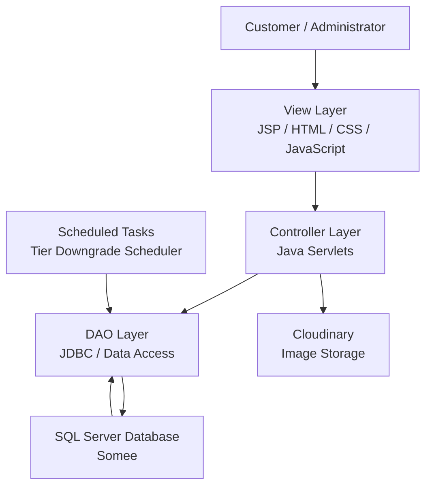

# Smart Automated Car Wash System

A web-based car wash management and booking system that allows customers to book car wash services while providing administrators with tools to manage bookings, services, vehicles, promotions, customers, loyalty points, and membership tiers.

The system is developed as a Java Web application using the MVC architecture and is deployed to the cloud using Docker and Render.
## Live Demo

**Application:**
https://smart-automated-car-wash-system.onrender.com/backend

> The application is currently deployed on Render using Docker.
## Key Features

### Customer Features

* **User Authentication** — Register, login, logout, and session-based access control.
* **Vehicle Management** — Add and manage vehicles associated with the customer account.
* **Service Booking** — Select a vehicle, car wash service, date, and available time slot to create a booking.
* **Booking Management** — View booking details and track booking history.
* **Promotion System** — Apply eligible promotions based on promotion rules and customer membership tier.
* **Loyalty Points** — Earn and redeem loyalty points through the booking process.
* **Membership Tiers** — Customer membership levels are automatically evaluated based on accumulated spending and activity.
* **Digital Wallet** — Manage wallet balance and use it as a payment method for bookings.

### Admin Features

* **Dashboard** — Monitor and manage the overall car wash operation.
* **Booking Management** — View and manage customer bookings.
* **Service Management** — Create, update, and manage available car wash services.
* **Vehicle Management** — Manage vehicle-related information used by the system.
* **Promotion Management** — Create and manage promotional campaigns and usage limits.
* **Customer Management** — Manage customer accounts and membership information.
* **Membership Tier Management** — Configure and manage customer membership tiers.

### System Features

* **Role-Based Access Control** — Separate customer and administrator access through authentication and authorization.
* **Automated Tier Processing** — Scheduled background processing for membership tier evaluation and downgrade logic.
* **Cloud Deployment** — Containerized deployment using Docker and hosted on Render.
* **Cloud Database** — Production database hosted on Somee and accessed remotely by the deployed application.
## Technology Stack

### Backend

| Technology          | Purpose                                    |
| ------------------- | ------------------------------------------ |
| **Java 8**          | Core programming language                  |
| **Java Servlet**    | Handles HTTP requests and application flow |
| **JSP**             | Server-side view rendering                 |
| **JDBC**            | Database connectivity and SQL operations   |
| **Apache Tomcat 9** | Java Web application server                |

### Frontend

| Technology      | Purpose                                          |
| --------------- | ------------------------------------------------ |
| **JSP / HTML5** | Web page structure and server-side rendering     |
| **CSS3**        | User interface styling                           |
| **JavaScript**  | Client-side interactions and dynamic UI behavior |

### Database & Storage

| Technology                    | Purpose                               |
| ----------------------------- | ------------------------------------- |
| **Microsoft SQL Server 2019** | Relational database management system |
| **Somee**                     | Cloud-hosted SQL Server database      |
| **Cloudinary**                | External image storage and management |

### Development & Deployment

| Technology          | Purpose                                    |
| ------------------- | ------------------------------------------ |
| **Apache NetBeans** | Java Web application development           |
| **Apache Ant**      | Project build and WAR packaging            |
| **Git / GitHub**    | Version control and source code management |
| **Docker**          | Containerized application runtime          |
| **Render**          | Cloud deployment and hosting               |

### Architecture & Patterns

* **MVC (Model–View–Controller)** — separates request handling, presentation, and application components.
* **DAO (Data Access Object)** — encapsulates database access logic.
* **JDBC** — provides communication between the Java application and SQL Server.

## System Architecture

The system follows a **Java Web MVC architecture combined with the DAO pattern**. The architecture separates the presentation layer, request handling, data access, and external services to keep the application organized and maintainable.



### Architecture Components

| Component               | Responsibility                                                                                                                      |
| ----------------------- | ----------------------------------------------------------------------------------------------------------------------------------- |
| **View Layer**          | Provides the user interface using JSP, HTML, CSS, and JavaScript.                                                                   |
| **Controller Layer**    | Handles HTTP requests, validates input, manages application flow, and coordinates data access.                                      |
| **DAO Layer**           | Encapsulates database operations using JDBC and provides data access methods for the application.                                   |
| **SQL Server Database** | Stores application data such as customers, vehicles, bookings, services, promotions, wallets, loyalty points, and membership tiers. |
| **Cloudinary**          | Provides external image storage for application-managed images.                                                                     |
| **Scheduled Tasks**     | Executes background tasks such as automatically processing customer membership tier downgrades.                                     |

### Request Flow

A typical user request follows this flow:

```text
Customer / Administrator
          ↓
     JSP / Frontend
          ↓
   Java Servlet Controller
          ↓
        DAO
          ↓
    SQL Server Database
```

For operations involving uploaded or stored images, the application also communicates with **Cloudinary**.

Background tasks such as membership tier processing run independently through the application's scheduler and access the database through the DAO layer.
## Project Structure

The project is organized into separate backend source code, web resources, database scripts, and documentation.

```text
Smart_Automated_Car_Wash_System/
│
├── backend/
│   │
│   ├── src/
│   │   └── java/
│   │       ├── config/
│   │       ├── controller/
│   │       ├── dao/
│   │       ├── dto/
│   │       ├── filter/
│   │       ├── listener/
│   │       ├── scheduler/
│   │       └── utils/
│   │
│   ├── web/
│   │   ├── assets/
│   │   ├── components/
│   │   ├── views/
│   │   ├── META-INF/
│   │   └── WEB-INF/
│   │
│   ├── lib/
│   ├── Dockerfile
│   └── .gitignore
│
├── database/
│   └── Database scripts and SQL resources
│
├── docs/
│   └── Project documentation and supporting materials
│
├── .gitignore
└── README.md
```

### Backend Structure

| Directory              | Responsibility                                                                                      |
| ---------------------- | --------------------------------------------------------------------------------------------------- |
| `src/java/config/`     | Application configuration and configuration-related classes.                                        |
| `src/java/controller/` | Java Servlet controllers responsible for handling HTTP requests and coordinating application flows. |
| `src/java/dao/`        | Data Access Objects responsible for communicating with the SQL Server database through JDBC.        |
| `src/java/dto/`        | Data Transfer Objects used to transfer structured data between application components.              |
| `src/java/filter/`     | Servlet filters for request-level processing such as authentication and access control.             |
| `src/java/listener/`   | Application lifecycle and session-related event handling.                                           |
| `src/java/scheduler/`  | Background scheduled tasks, including membership tier processing.                                   |
| `src/java/utils/`      | Shared utility classes such as database connection and common helper functions.                     |

### Web Structure

| Directory         | Responsibility                                                               |
| ----------------- | ---------------------------------------------------------------------------- |
| `web/assets/`     | Static frontend resources such as CSS, JavaScript, images, and other assets. |
| `web/components/` | Reusable JSP components for common UI elements.                              |
| `web/views/`      | JSP pages responsible for rendering application interfaces.                  |
| `web/WEB-INF/`    | Web application configuration and protected resources.                       |
| `web/META-INF/`   | Web application metadata and deployment-related configuration.               |

### Supporting Directories

| Directory      | Responsibility                                             |
| -------------- | ---------------------------------------------------------- |
| `backend/lib/` | Third-party Java libraries required by the application.    |
| `database/`    | SQL scripts and database-related resources.                |
| `docs/`        | Project documentation, diagrams, and supporting materials. |
## Main Modules

The system is divided into several functional modules that cover the main business operations of an automated car wash service.

### 1. Authentication & Authorization

Handles user authentication and access control across the system.

* User login and logout
* Session management
* Role-based access control
* Protected resources for authenticated users
* Separate customer and administrator workflows

### 2. Customer & Profile Management

Manages customer information and personalized account data.

* Customer profile management
* Customer vehicle management
* Membership tier information
* Customer spending and service history
* Loyalty point information

### 3. Vehicle Management

Allows customers to manage the vehicles associated with their accounts.

* Add and manage vehicles
* Store vehicle information and vehicle types
* Select a vehicle when creating a booking
* Support vehicle-specific service selection

### 4. Service & Booking Management

Provides the core car wash booking workflow.

* Browse available car wash services
* View service prices and durations
* Select vehicle and service package
* Select available date and time slot
* Create and manage bookings
* View booking history
* Validate booking availability

### 5. Promotion Management

Provides promotional campaigns and discount functionality.

* Display active promotions
* Validate promotion eligibility
* Apply discounts to bookings
* Support minimum order requirements
* Track promotion usage and usage limits
* Target promotions based on customer membership tiers

### 6. Loyalty & Membership Management

Manages customer loyalty points and membership tiers.

* Earn loyalty points from completed transactions
* Redeem loyalty points
* Maintain loyalty point history
* Calculate customer tier-related metrics
* Process membership tier changes
* Automatically handle scheduled tier downgrade processing

### 7. Wallet & Payment Management

Provides customer wallet and booking payment functionality.

* Create and manage customer wallets
* Check wallet balance
* Support wallet-based payments
* Support cash payments
* Support QR-based payment flow
* Update customer spending and service statistics after successful payment

### 8. Administration

Provides administrators with tools to manage the car wash system.

* Manage customers
* Manage vehicles
* Manage services
* Manage time slots
* Manage promotions
* Manage membership tiers
* Manage bookings
* View and monitor system data

### 9. Scheduled Processing

Provides background processing for tasks that do not require direct user interaction.

* Scheduled membership tier evaluation
* Automatic tier downgrade processing
* Database updates performed by scheduled tasks
## Database

The system uses **Microsoft SQL Server** as its relational database management system.

The production database is hosted on **Somee**, while the application connects to it through JDBC using environment-based database configuration.

### Database Name

```text
CAR_WASH_DB
```

### Database Design

The database is designed around the main business workflows of a car wash management system:

* User authentication and role management
* Customer profiles and membership tiers
* Vehicle management
* Car wash services
* Booking and scheduling
* Promotions and voucher usage
* Loyalty points
* Digital wallet and transactions
* Payment records
* Notifications
* Customer feedback

### Main Entities

| Entity                 | Responsibility                                                                |
| ---------------------- | ----------------------------------------------------------------------------- |
| `Role`                 | Defines system roles such as Admin, Staff, and Customer                       |
| `User`                 | Stores authentication and account information                                 |
| `Customer`             | Stores customer-specific information, statistics, points, and membership tier |
| `Tiers`                | Defines membership levels and their benefits                                  |
| `Brand`                | Stores vehicle manufacturers                                                  |
| `Model`                | Stores vehicle models associated with brands                                  |
| `Vehicle`              | Stores customer vehicle information                                           |
| `Service`              | Defines available car wash services and pricing                               |
| `Bay`                  | Manages physical car wash bays                                                |
| `Slot`                 | Defines available booking time slots                                          |
| `Booking`              | Stores customer appointments and booking information                          |
| `BookingService`       | Stores services included in each booking                                      |
| `Promotion`            | Stores promotional campaigns and voucher rules                                |
| `PromotionUsage`       | Tracks promotion usage by bookings                                            |
| `Payment`              | Stores payment information associated with bookings                           |
| `Wallet`               | Stores customer wallet balances                                               |
| `WalletTransaction`    | Records wallet deposits and payments                                          |
| `LoyaltyPointHistory`  | Tracks earned and used loyalty points                                         |
| `CustomerMonthlyStats` | Stores monthly customer spending and wash statistics                          |
| `Notifications`        | Stores system notifications for users                                         |
| `Feedback`             | Stores customer ratings and comments                                          |

### Key Relationships

The core relationships of the database include:

```text
User
 ├── Role
 └── Customer
      ├── Tiers
      ├── Vehicle
      │    └── Model
      │         └── Brand
      ├── Wallet
      │    └── WalletTransaction
      ├── LoyaltyPointHistory
      └── Booking
           ├── Slot
           ├── Bay
           ├── Promotion
           ├── BookingService
           │    └── Service
           ├── Payment
           └── Feedback
```

Foreign keys are used to maintain referential integrity between related entities. For example, a booking references its customer, vehicle, slot, bay, and optional promotion.

The database also uses constraints to enforce business rules, such as valid user roles, membership tiers, positive service prices, non-negative wallet balances, and valid booking/payment states.

### Database Schema

The complete SQL schema and seed data are available in the [`database`](./database) directory.

This allows the database structure to be recreated independently from the application source code.
## Deployment

The application is deployed as a containerized Java Web application using **Docker** and **Render**.

### Production Architecture

```text
Developer
    │
    │ git push
    ▼
GitHub Repository
    │
    │ Automatic deployment
    ▼
Render
    │
    │ Docker build
    ▼
Docker Container
    │
    ├── Tomcat 9
    ├── JDK 8
    └── backend.war
            │
            ├── JDBC ──────────► Somee SQL Server
            │
            └── Cloudinary ────► Image Storage
```

### Deployment Process

1. The application source code is maintained in a GitHub repository.
2. The Java Web application is built using **Apache Ant through NetBeans**.
3. NetBeans generates the production WAR package:

```text
backend/dist/backend.war
```

4. The backend contains a Dockerfile that uses **Tomcat 9 with JDK 8** as the runtime environment.
5. Render retrieves the source code from GitHub and builds the Docker image.
6. The WAR package is copied into the Tomcat `webapps` directory inside the container.
7. Tomcat starts the application and serves the deployed WAR application.
8. The application connects to the production **SQL Server database hosted on Somee** through JDBC.
9. **Cloudinary** is used for application image storage.
10. Render exposes the running application through a public HTTPS URL.

### Docker Configuration

The backend uses the following Docker configuration:

```dockerfile
FROM tomcat:9-jdk8-temurin

RUN rm -rf /usr/local/tomcat/webapps/*

COPY backend/dist/backend.war /usr/local/tomcat/webapps/backend.war

EXPOSE 8080

CMD ["catalina.sh", "run"]
```

The Docker image provides a consistent runtime environment so the application does not depend on the Tomcat installation or Java configuration of the deployment server.

### Production URL

The deployed application is available at:

**[Live Demo](https://smart-automated-car-wash-system.onrender.com/backend)**

### Deployment Considerations

The application uses environment variables for production configuration such as database credentials and external service configuration.

Sensitive credentials are not stored directly in the source code or GitHub repository.

For the current deployment, **Render** is responsible for running the container, while **Somee** hosts the production SQL Server database.
## Installation / Local Setup

Follow the steps below to run the project locally.

### Prerequisites

Make sure the following software is installed:

* **JDK 8**
* **Apache NetBeans**
* **Apache Tomcat 9**
* **Microsoft SQL Server**
* **SQL Server Management Studio (SSMS)**
* **Git**

### 1. Clone the Repository

```bash
git clone https://github.com/kiethk/Smart_Automated_Car_Wash_System.git
cd Smart_Automated_Car_Wash_System
```

### 2. Database Setup

The database scripts are located in:

```text
database/
```

Open the SQL scripts using **SQL Server Management Studio** and execute them in the following order:

1. Create the database and tables.
2. Create constraints and relationships.
3. Insert the initial seed data.

The database name used by the application is:

```text
CAR_WASH_DB
```

### 3. Open the Backend Project

Open **Apache NetBeans** and select:

```text
backend/
```

as the project directory.

The backend is a Java Web Application using the following technologies:

```text
Java 8
Servlet / JSP
Apache Tomcat 9
Apache Ant
Microsoft SQL Server
```

### 4. Configure Tomcat

In NetBeans:

1. Open **Tools → Servers**.
2. Add or configure an **Apache Tomcat 9** server.
3. Select the installed JDK 8.
4. Set the Tomcat installation directory.
5. Make sure the backend project is configured to use Tomcat 9.

### 5. Configure Database Connection

The application reads database configuration from environment variables.

For local development, the application provides default values in `DBUtils`:

```text
DB_HOST=localhost
DB_PORT=1433
DB_NAME=CAR_WASH_DB
DB_USER=SA
DB_PASSWORD=12345
```

It is recommended to override these values through environment variables rather than modifying the source code.

### 6. Verify Required Libraries

The project includes its required third-party libraries under:

```text
backend/lib/
```

and the web application's libraries under:

```text
backend/web/WEB-INF/lib/
```

These include libraries for:

* SQL Server JDBC connectivity
* JSTL
* Cloudinary
* Standard Java Web functionality

### 7. Clean and Build

In NetBeans, right-click the backend project and select:

```text
Clean and Build
```

A successful build should generate:

```text
backend/dist/backend.war
```

### 8. Run the Application

Right-click the backend project in NetBeans and select:

```text
Run
```

NetBeans will deploy the application to the configured Tomcat server.

The application will normally be accessible through:

```text
http://localhost:8080/backend
```

### 9. Verify the Application

After starting the application:

1. Open the local application URL in a browser.
2. Verify that the login page loads correctly.
3. Test customer authentication.
4. Test vehicle and service management.
5. Test booking and payment workflows.
6. Verify that data is correctly stored in SQL Server.

### Troubleshooting

#### Database connection failed

Check that:

* SQL Server is running.
* The `CAR_WASH_DB` database exists.
* TCP/IP is enabled for SQL Server.
* Port `1433` is available.
* The configured database credentials are correct.

#### Application does not start

Check that:

* JDK 8 is configured correctly.
* Tomcat 9 is running.
* The project is configured as a Java Web Application.
* Required JAR files exist under `backend/lib/` and `backend/web/WEB-INF/lib/`.

#### WAR file is not generated

Run:

```text
Clean and Build
```

again in NetBeans and verify that:

```text
backend/dist/backend.war
```

has been generated.
## 12. Environment Variables

The application uses environment variables to separate deployment-specific configuration from the application source code.

This approach allows the same application codebase to be used in both local development and production environments without exposing database credentials in the GitHub repository.

### Database Configuration

| Variable      | Description              | Example       |
| ------------- | ------------------------ | ------------- |
| `DB_HOST`     | SQL Server database host | `localhost`   |
| `DB_PORT`     | SQL Server port          | `1433`        |
| `DB_NAME`     | Database name            | `CAR_WASH_DB` |
| `DB_USER`     | Database username        | `SA`          |
| `DB_PASSWORD` | Database password        | `********`    |

### Local Development

For local development, the application can use the following configuration:

```env
DB_HOST=localhost
DB_PORT=1433
DB_NAME=CAR_WASH_DB
DB_USER=SA
DB_PASSWORD=your_local_password
```

The application reads these values through environment variables. If a variable is not provided, the application falls back to its configured default value for local development.

### Production Environment

For the production deployment on **Render**, database credentials are configured through Render's Environment Variables settings rather than being committed to GitHub.

Example:

```env
DB_HOST=<production-database-host>
DB_PORT=<production-database-port>
DB_NAME=CAR_WASH_DB
DB_USER=<production-database-user>
DB_PASSWORD=<production-database-password>
```

> **Security:** Never commit real database passwords, API keys, access tokens, or other secrets to the GitHub repository.

### Configuration Flow

```text
Environment Variables
        │
        ▼
     DBUtils
        │
        ▼
 JDBC Connection
        │
        ▼
 SQL Server Database
```

This configuration strategy makes it possible to deploy the same application to different environments by changing configuration values without modifying the application source code.
